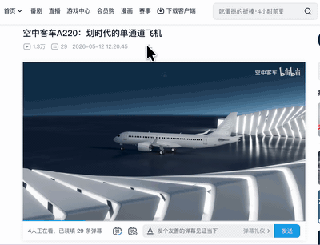
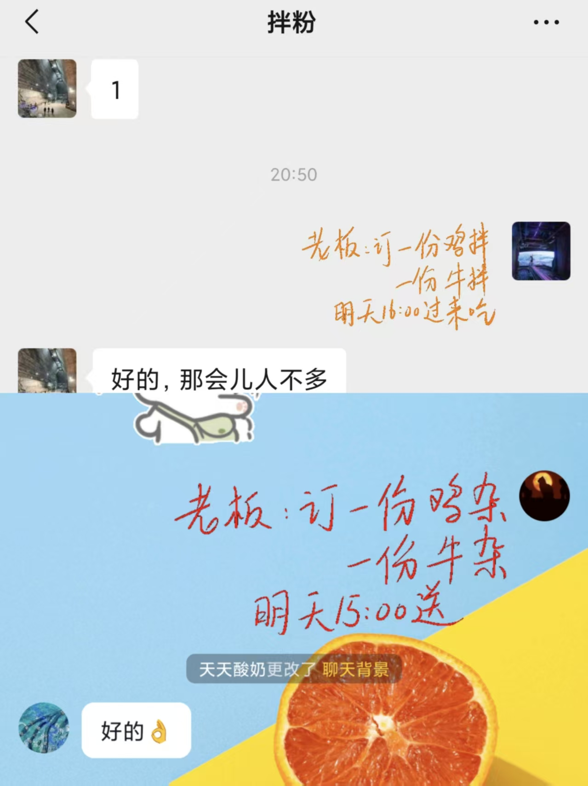
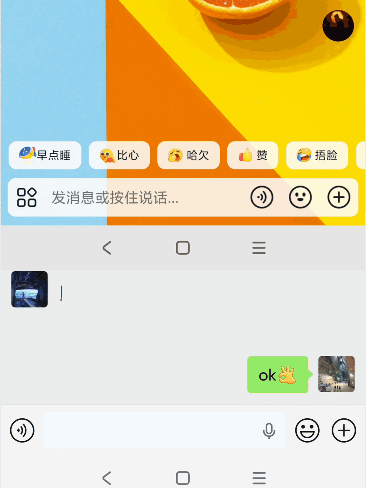

[English](./README_EN.md)

# 玻璃涂鸦

实现了键鼠和数位板的分离.  
相当于在显示器前加了一面玻璃做笔记.

普通的数位笔不在笔记软件中操作时, 会被操作系统当成鼠标, 本人不希望数位笔有鼠标的作用.  
此APP适用于远程会议 远程教学 屏幕标注 临时便签 等场景.

平台:

- Mac OS
- Windows (Windows数位板驱动需打开 Microsoft Ink)

功能:

- 发送手写消息
  微信抖音把小GIF图片当做表情包显示, 利用这一特性, 可以在屏幕上涂鸦,然后在微信中粘贴即可发送手写体消息 (3行以内 大约50字).

- 导出 有背景截图/ 无背景截图/ xournal格式

- 设置线条粗细 颜色

- 模糊背景(模糊背景时仍可用键鼠操作其他APP) 以便凸显笔迹.

- 贝塞尔算法消除笔迹的手抖

快捷键:

| 功能                                  | macOS       | Windows          |
| ------------------------------------- | ----------- | ---------------- |
| 清屏                                  | `⌘ + ⌃ + C` | `Ctrl + Alt + C` |
| 撤销上一笔                            | `⌘ + ⌃ + Z` | `Ctrl + Alt + Z` |
| 开启/关闭涂鸦                         | `⌘ + ⌃ + V` | `Ctrl + Alt + V` |
| 上一页                                | `⌘ + ⌃ + J` | `Ctrl + Alt + J` |
| 下一页                                | `⌘ + ⌃ + K` | `Ctrl + Alt + K` |
| 导出 SVG + GIF 并复制图片到系统剪切板 | `⌘ + ⌃ + G` | `Ctrl + Alt + G` |
| 模糊背景 磨砂玻璃开关                 | `⌘ + ⌃ + B` | `Ctrl + Alt + B` |
| 打开设置                              | `⌘ + ⌃ + ,` |                  |
| 退出玻璃笔记                          |             | `Ctrl + Alt + Q` |

安装:

- 根据引导,在设置中添加辅助功能和录屏权限(本APP不联网, 权限用于保存带背景的笔迹截图).

开发环境:

- Mac OS + Rust + Flutter
- Windows + Rust + C# + Flutter
