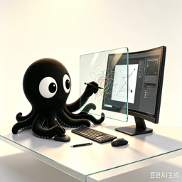
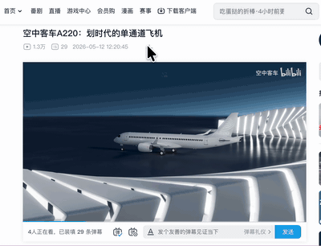
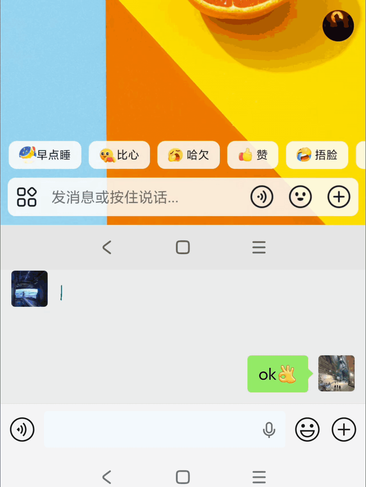

[English](./README_EN.md)

# 玻璃涂鸦

实现了键鼠和数位板的分离.  
相当于在显示器前加了一面玻璃做笔记.

普通的数位笔不在笔记软件中操作时, 会被操作系统当成鼠标, 本人不希望数位笔有鼠标的作用.  
此APP适用于远程会议 远程教学 屏幕标注 临时便签 等场景.

平台:

- Mac OS
- Windows (直接读取 Raw HID, 压感可用, 不依赖 Microsoft Ink)

## 两种画布模式

在设置面板顶部 tab, 或菜单「无限画布」切换; 两种模式的笔迹**独立存储**.

- **活页本(翻页)模式** — 一页一屏, 经典翻页
  - `⌥⌘↑` / `⌥⌘↓`: 视图上下滑动一小步(约等于浏览器方向键一次的距离), 滑过页边界会自动切到相邻页; 只做上下移动.
  - `⌘⌃J` / `⌘⌃K`: 整页翻到上一页 / 下一页(带滑动动效).
  - 滚动时相邻页的笔迹与页码会一起绘制, 页与页之间有加粗分界线.
  - 设置面板「活页本」tab: 屏幕右缘竖向 minimap(附近 10 页缩略图).
- **无限画布(自由涂鸦)模式** — 一块没有边界的画布, 目前全局只有一张
  - `⌥⌘↑ / ⌥⌘↓ / ⌥⌘← / ⌥⌘→` 平移镜头.
  - `⌘⌃滚轮` 平移, `⌥⇧滚轮` 以鼠标位置为锚缩放(上限 100%), `⌘⌃PageUp` / `⌘⌃PageDown` 键盘缩放.

功能:

- **快捷录制 GIF**
  按住 `⌘⌃R` 涂鸦, 松开手自动把这段涂鸦生成动画 GIF 并复制到系统剪切板.
  设置面板可调 帧率(10–50fps) / 分辨率(25%–100%) / 速度(0.5×–20×) / 结束方式(停在最后一下 · 停 1 秒后循环 · 结束后立即循环), 并灰色显示预估文件大小.

- **发送手写消息**
  微信抖音把小GIF图片当做表情包显示, 利用这一特性, 可以在屏幕上涂鸦,然后在微信中粘贴即可发送手写体消息 (3行以内 大约50字).
  按住 `⌘⌃3` 也可直接把手写笔迹作为一条消息发出去.

- **导出** 有背景截图 / 无背景截图 / Xournal 笔记 / SVG / GIF / PDF
  无限画布可单独导出: 按屏幕尺寸**分页的 PDF**, 或**整幅 SVG**(按内容包围盒, 不受当前镜头影响).

- **网格** 格距可调; 只在「屏幕尺寸」整数倍处画加粗分界线(活页本 = 页边界, 无限画布 = 每屏一条参考线).

- **笔迹描边** 给笔迹加对比描边, 亮底/暗底都看得清(纯渲染开关).

- **颜色 / 粗细** 全饱和色板 + 8 档粗细预设.

- **模糊背景** 磨砂玻璃凸显笔迹(模糊时仍可用键鼠操作其他APP).

- **压力监控 / 彩虹指示器 / 开机自启**.

- **贝塞尔平滑** ink-stroke-modeler 消除手抖, 支持压感变宽.

快捷键:

| 功能                                  | macOS                    | Windows                           |
| ------------------------------------- | ------------------------ | --------------------------------- |
| 新建画布                              | `⌘ + ⌃ + C`              | `Ctrl + Alt + C`                  |
| 撤销上一笔                            | `⌘ + ⌃ + Z`              | `Ctrl + Alt + Z`                  |
| 开启/关闭涂鸦                         | `⌘ + ⌃ + V`              | `Ctrl + Alt + V`                  |
| 切换画布模式 (固定画布 ↔ 飘渺画布)     | `⌘ + ⌃ + X`              | `Ctrl + Alt + X`                  |
| 上一页 / 下一页 (整页翻页)            | `⌘ + ⌃ + J` / `⌘ + ⌃ + K` | `Ctrl + Alt + J` / `Ctrl + Alt + K` |
| 导出 SVG + GIF 并复制图片到系统剪切板 | `⌘ + ⌃ + G`              | `Ctrl + Alt + G`                  |
| 复制当前涂鸦为 SVG                    | `⌘ + ⌃ + S`              |                                   |
| 模糊背景 磨砂玻璃开关                 | `⌘ + ⌃ + B`              | `Ctrl + Alt + B`                  |
| 打开设置                              | `⌘ + ⌃ + ,`              |                                   |
| 退出玻璃笔记                          |                          | `Ctrl + Alt + Q`                  |
| 快捷录制 GIF (按住)                   | `⌘ + ⌃ + R`              | `Ctrl + Alt + R` (按住)           |
| 录制手写消息 (按住)                   | `⌘ + ⌃ + 3`              |                                   |
| 活页本: 上下滑动 (跨页自动切页)        | `⌥ + ⌘ + ↑` / `⌥ + ⌘ + ↓` |                                   |
| 无限画布: 镜头四向平移                | `⌥ + ⌘ + 方向键`          | `Ctrl + Alt + 方向键`             |
| 无限画布: 缩放 (光标为锚)             | `⌥ + ⇧ + 滚轮`           | `Ctrl + Alt + 滚轮`               |
| 无限画布: 键盘缩放                    | `⌘ + ⌃ + PageUp` / `⌘ + ⌃ + PageDown` | `Ctrl + Alt + PageUp` / `Ctrl + Alt + PageDown` |

安装:

- 根据引导,在设置中添加辅助功能和录屏权限(用于全局快捷键, 以及保存带背景的笔迹截图).

开发环境:

- Mac OS + Rust + Flutter
- Windows + Rust + Flutter
