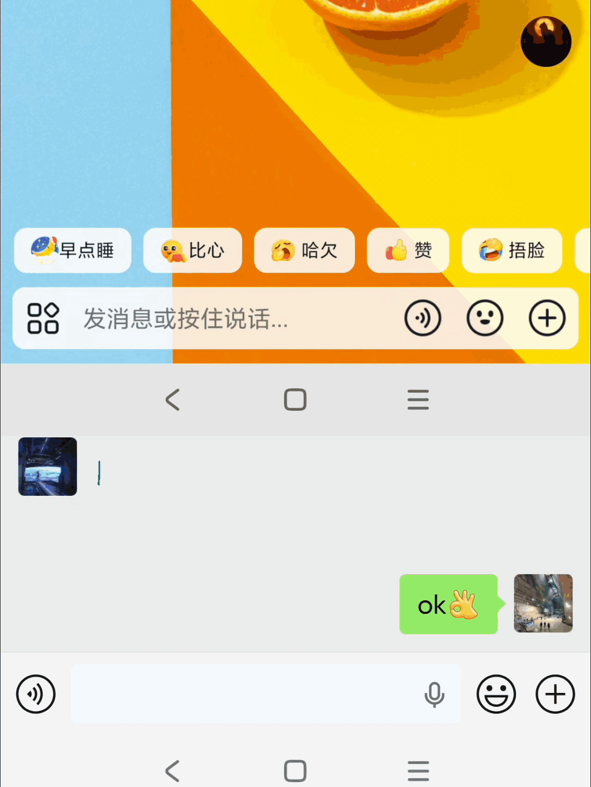
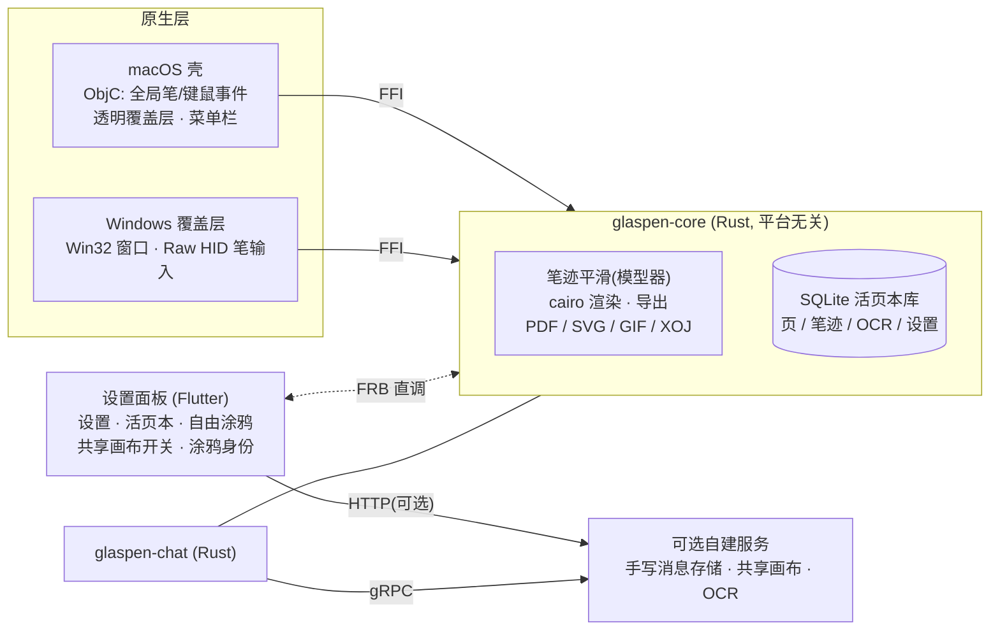

[English](./README_EN.md)

# 玻璃涂鸦

实现了键鼠和数位板的分离.  
相当于在显示器前加了一面玻璃做笔记.

普通的数位笔不在笔记软件中操作时, 会被操作系统当成鼠标, 本人不希望数位笔有鼠标的作用.  
此APP适用于远程会议 远程教学 屏幕标注 临时便签 等场景.

平台:

- Mac OS
- Windows (直接读取 Raw HID, 压感可用, 不依赖 Microsoft Ink)

## 两种画布模式

在设置面板顶部 tab, 或菜单「无限画布」切换; 两种模式的笔迹**独立存储**.

- **活页本(翻页)模式** — 一页一屏, 经典翻页(整页翻转, 窗口原生淡入淡出动效)
  - `⌥⌘↑` / `⌥⌘↓` 或 `⌘⌃~` / `⌘⌃1`: 整页翻到上一页 / 下一页.
  - 设置面板「活页本」tab: 屏幕右缘竖向 minimap(附近 10 页缩略图), 页面网格支持**批量多选删除**.
- **无限画布(自由涂鸦)模式** — 一块没有边界的画布, 目前全局只有一张
  - `⌥⌘↑ / ⌥⌘↓ / ⌥⌘← / ⌥⌘→` 平移镜头.
  - `⌘⌃滚轮` 平移, `⌥⇧滚轮` 以鼠标位置为锚缩放(上限 100%), `⌘⌃PageUp` / `⌘⌃PageDown` 键盘缩放.

功能:

- **快捷录制 GIF**
  按住 `⌘⌃R` 涂鸦, 松开手自动把这段涂鸦生成动画 GIF 并复制到系统剪切板.
  设置面板可调 帧率(10–50fps) / 分辨率(25%–100%) / 速度(0.5×–20×) / 结束方式(停在最后一下 · 停 1 秒后循环 · 结束后立即循环), 并灰色显示预估文件大小.

- **发送手写消息**
  微信抖音把小GIF图片当做表情包显示, 利用这一特性, 可以在屏幕上涂鸦,然后在微信中粘贴即可发送手写体消息 (3行以内 大约50字).
  按住 `⌘⌃3` 也可直接把手写笔迹作为一条消息发出去.

- **导出** 有背景截图 / 无背景截图 / Xournal 笔记 / SVG / GIF / PDF
  无限画布可单独导出: 按屏幕尺寸**分页的 PDF**, 或**整幅 SVG**(按内容包围盒, 不受当前镜头影响).
  可选: 配合自建 OCR 服务, PDF 内嵌**可复制/可搜索的文字层**(笔迹照常显示, 文本隐形).

- **网格** 格距可调; 只在「屏幕尺寸」整数倍处画加粗分界线(活页本 = 页边界, 无限画布 = 每屏一条参考线).
  可选「分栏」参考线: 左右两栏 / 上下两栏 / 九宫格 —— 把对应切分位置(1/2 或 1/3、2/3)最近的网格线加粗一档, 半屏当两栏书写时更直观(纯视觉).

- **笔迹描边** 给笔迹加对比描边, 亮底/暗底都看得清(纯渲染开关).

- **颜色 / 粗细** 全饱和色板 + 8 档粗细预设.

- **模糊背景** 磨砂玻璃凸显笔迹(模糊时仍可用键鼠操作其他APP).

- **压力监控 / 彩虹指示器 / 开机自启**.

- **检查更新 / 自动更新** 设置面板「关于」区一键查询 GitHub 最新正式版; macOS 可「立即更新」—— 下载校验、退出重启、自动替换正在运行的旧版, 失败自动回滚.

- **贝塞尔平滑** ink-stroke-modeler 消除手抖, 支持压感变宽.

## 架构

```mermaid
flowchart LR
    subgraph native["原生层"]
        MAC["macOS 壳
ObjC: 全局笔/键鼠事件
透明覆盖层 · 菜单栏"]
        WIN["Windows 覆盖层
Win32 窗口 · Raw HID 笔输入"]
    end
    subgraph core["glaspen-core (Rust, 平台无关)"]
        ENGINE["笔迹平滑(模型器)
cairo 渲染 · 导出
PDF / SVG / GIF / XOJ"]
        DB[("SQLite 活页本库
页 / 笔迹 / OCR / 设置")]
    end
    PANEL["设置面板 (Flutter)
设置 · 活页本 · 自由涂鸦
共享画布开关 · 涂鸦身份"]
    AXUM["可选自建服务
手写消息存储 · 共享画布 · OCR"]

    MAC -- "FFI" --> core
    WIN -- "FFI" --> core
    PANEL <-. "FRB 直调" .-> core
    PANEL -- "HTTP(可选)" --> AXUM
    CHAT["glaspen-chat (Rust)"] -- "gRPC" --> AXUM
    CHAT --- core
```

- **原生层**:macOS 是 ObjC(全局事件 + 覆盖层窗口),Windows 是纯 Rust Win32;涂鸦体验全部由这一层实现.
- **glaspen-core**:平台无关的共享核心 —— 存储、平滑、渲染、导出、更新、手写消息/共享上行/OCR 的 FFI.
- **设置面板**:Flutter, 与 Rust 同进程 FRB 直调; 默认只显示「设置 + 活页本」两个 tab, 进阶能力按需打开.
- **可选自建服务**:手写消息/共享画布/OCR 都是对接自建 axum 服务的增强功能, 不配置则完全静默, 不影响涂鸦.

快捷键:

| 功能                                  | macOS                    | Windows                           |
| ------------------------------------- | ------------------------ | --------------------------------- |
| 新建画布                              | `⌘ + ⌃ + C`              | `Ctrl + Alt + C`                  |
| 撤销上一笔                            | `⌘ + ⌃ + Z`              | `Ctrl + Alt + Z`                  |
| 开启/关闭涂鸦                         | `⌘ + ⌃ + V`              | `Ctrl + Alt + V`                  |
| 切换画布模式 (固定画布 ↔ 飘渺画布)     | `⌘ + ⌃ + X`              | `Ctrl + Alt + X`                  |
| 上一页 / 下一页 (整页翻页)            | `⌥ + ⌘ + ↑/↓`、`⌘ + ⌃ + ~ / 1` | `Ctrl + Alt + J` / `Ctrl + Alt + K` |
| 导出 SVG + GIF 并复制图片到系统剪切板 | `⌘ + ⌃ + G`              | `Ctrl + Alt + G`                  |
| 复制当前涂鸦为 SVG                    | `⌘ + ⌃ + S`              |                                   |
| 模糊背景 磨砂玻璃开关                 | `⌘ + ⌃ + B`              | `Ctrl + Alt + B`                  |
| 打开设置                              | `⌘ + ⌃ + ,`              |                                   |
| 退出玻璃笔记                          |                          | `Ctrl + Alt + Q`                  |
| 快捷录制 GIF (按住)                   | `⌘ + ⌃ + R`              | `Ctrl + Alt + R` (按住)           |
| 录制手写消息 (按住)                   | `⌘ + ⌃ + 3`              |                                   |
| 无限画布: 镜头四向平移                | `⌥ + ⌘ + 方向键`          | `Ctrl + Alt + 方向键`             |
| 无限画布: 缩放 (光标为锚)             | `⌥ + ⇧ + 滚轮`           | `Ctrl + Alt + 滚轮`               |
| 无限画布: 键盘缩放                    | `⌘ + ⌃ + PageUp` / `⌘ + ⌃ + PageDown` | `Ctrl + Alt + PageUp` / `Ctrl + Alt + PageDown` |

安装:

- 根据引导,在设置中添加辅助功能和录屏权限(用于全局快捷键, 以及保存带背景的笔迹截图).

开发环境:

- Mac OS + Rust + Flutter
- Windows + Rust + Flutter
