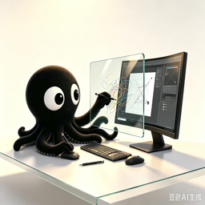
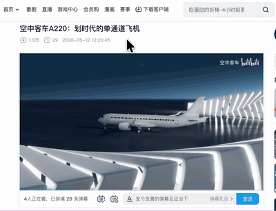
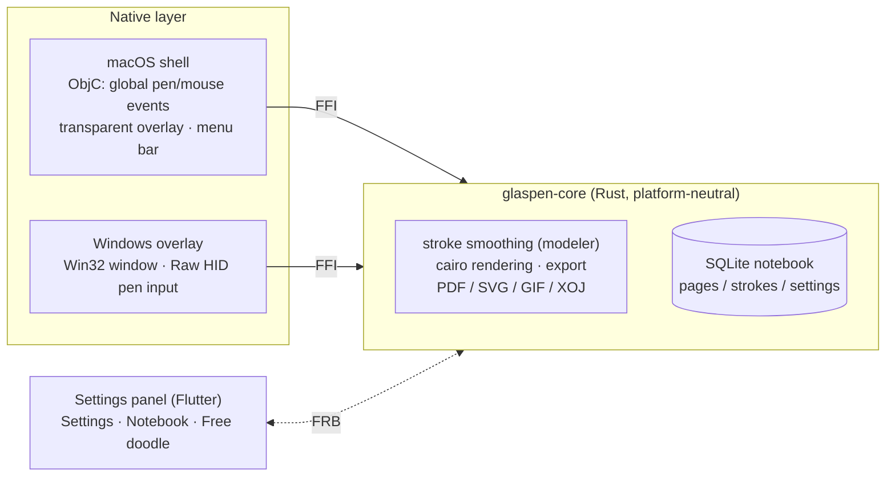

[中文](./README.md)

# Glaspen2

Separates the pen from the mouse.  
Like writing on a glass overlay in front of your monitor.

A regular stylus is treated as a mouse by the OS — this app removes that behavior.  
Ideal for remote meetings, teaching, screen annotation, and quick notes.

## Platforms

- macOS
- Windows (reads the pen via Raw HID; pressure works, no Microsoft Ink required)

## Two canvas modes

Switch from the tabs at the top of the settings panel, or the "Infinite canvas" menu item. The two modes store strokes **independently**.

- **Notebook (paged) mode** — one page per screen, classic page flipping (whole-page flip with the native window fade)
  - `⌥⌘↑` / `⌥⌘↓` or `⌘⌃~` / `⌘⌃1`: flip a whole page to previous / next.
  - Page grid: **drag to reorder / nudge** (pen-side page flips follow automatically), **batch multi-select delete**, and a vertical minimap along the right edge (thumbnails of ~10 nearby pages).
  - **Page detail**: lasso strokes with the mouse, then **move / copy / paste / delete** the selection.
  - Switchable look: **skeuomorphic glass** (cards as true see-through holes / frosted) or **notepad**.
- **Infinite canvas (free doodle) mode** — one canvas with no borders (currently a single global canvas)
  - `⌥⌘↑ / ⌥⌘↓ / ⌥⌘← / ⌥⌘→` pan the lens.
  - `⌘⌃scroll` pans, `⌥⇧scroll` zooms anchored at the pointer (capped at 100%), `⌘⌃PageUp` / `⌘⌃PageDown` zoom from the keyboard.

## Features

- **Quick GIF recording**
  Hold `⌘⌃R`, doodle, release — the doodle is turned into an animated GIF and copied to the clipboard.
  Configurable in settings: frame rate (10–50 fps), resolution (25%–100%), speed (0.5×–20×) and ending (stop on the last stroke / hold 1 s then loop / loop immediately), with a grey estimated file size.

- **Export** screenshot with background / screenshot without background / Xournal notes / SVG / GIF / PDF
  The infinite canvas has its own exports: a **paged PDF** sized to the screen, or a **whole-canvas SVG** (content bounding box, unaffected by the current lens).

- **Grid** adjustable spacing; a heavier boundary line is drawn only at multiples of the screen size (page boundary in Notebook mode, one per screen on the infinite canvas).
  Optional **column guides** — vertical halves, horizontal halves, or a 3×3 grid — thicken the nearest grid line at each split position (1/2 or 1/3 & 2/3); purely visual, handy when using half a screen as one writing column.

- **Stroke outline / soft shadow** outline = black-and-white marching-ants dashes so strokes read on light or dark backgrounds; soft shadow = a gentle dark halo under the strokes, keeps them visible on same-color backgrounds. Both can be combined.

- **Color / width** full-saturation palette + 8 width presets.

- **Frosted glass background** blurs the desktop to make strokes stand out (mouse/keyboard still work with other apps).
  An experimental **true see-through** mode makes the cards fully transparent — the desktop behind the panel shows right through.

- **Pen buttons** with the driver set to Pen/Eraser or Eraser, pressing the pen button turns it into an eraser automatically (no configuration); set to Keyboard Key with a glaspen shortcut to flip pages / undo.

- **Pressure monitor / rainbow indicator / launch at login.**

- **Update check / auto-update** the About section of the settings panel queries the latest release on GitHub in one click; on macOS "Update now" downloads, verifies, quits and replaces the running app — with automatic rollback if the new version fails to start.

- **Bezier smoothing** via ink-stroke-modeler removes hand tremor and supports pressure width.

## Architecture

- **Native layer**: macOS uses ObjC (global events + overlay window), Windows is pure Rust Win32 — the doodling experience lives entirely here.
- **glaspen-core**: the platform-neutral shared core — storage, smoothing, rendering, export and updates.
- **Settings panel**: Flutter, talking to Rust in-process via FRB; by default only "Settings + Notebook" tabs are shown, advanced capabilities opt-in.

## Keyboard shortcuts

| Function | macOS | Windows |
| --- | --- | --- |
| New canvas | `⌘ + ⌃ + C` | `Ctrl + Alt + C` |
| Undo last stroke | `⌘ + ⌃ + Z` | `Ctrl + Alt + Z` |
| Toggle drawing | `⌘ + ⌃ + V` | `Ctrl + Alt + V` |
| Toggle canvas mode (fixed ↔ ethereal) | `⌘ + ⌃ + X` | `Ctrl + Alt + X` |
| Previous / next page (whole page) | `⌥ + ⌘ + ↑/↓`, `⌘ + ⌃ + ~ / 1` | `Ctrl + Alt + ↑/↓` |
| Export SVG + GIF (copies to clipboard) | `⌘ + ⌃ + G` | `Ctrl + Alt + G` |
| Copy current doodle as SVG | `⌘ + ⌃ + S` | |
| Frosted glass toggle | `⌘ + ⌃ + B` | `Ctrl + Alt + B` |
| Open settings | `⌘ + ⌃ + ,` | |
| Quit | | `Ctrl + Alt + Q` |
| Quick GIF recording (hold) | `⌘ + ⌃ + R` | `Ctrl + Alt + R` (hold) |
| Infinite canvas: pan (four directions) | `⌥ + ⌘ + arrows` | `Ctrl + Alt + arrows` |
| Infinite canvas: zoom (cursor anchored) | `⌥ + ⇧ + scroll` | `Ctrl + Alt + scroll` |
| Infinite canvas: keyboard zoom | `⌘ + ⌃ + PageUp` / `⌘ + ⌃ + PageDown` | `Ctrl + Alt + PageUp` / `Ctrl + Alt + PageDown` |

## Installation

Follow the on-screen guide to grant Accessibility and Screen Recording permissions (used for global shortcuts and for saving screenshots with background).

## Dev Environment

- macOS: Rust + Flutter
- Windows: Rust + Flutter
